# Task Processing System Documentation

## Overview
The Task Processing System is a distributed task execution framework that handles complex workflows through task groups and dependencies. It consists of several key components that work together to process tasks efficiently and reliably.

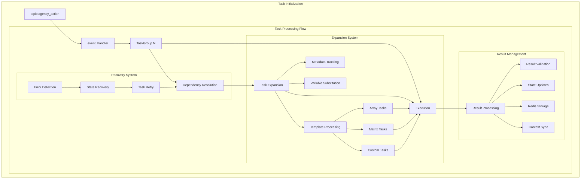

# Key Components

## AgencyTaskGroup

### Overview
The AgencyTaskGroup is a core component responsible for managing and coordinating the execution of multiple related task groups within a session. It handles high-level orchestration, context management, and ensures proper execution flow across task groups.

### Key Responsibilities

#### 1. Session Management
* **Context Management**: Maintains session context and state across multiple task groups
* **Redis Integration**: Creates and manages Redis mappings for task group results and dependencies  
* **Cleanup**: Handles cleanup of session data and context when processing completes

#### 2. Task Group Coordination
* **Instance Management**: Initializes and manages multiple TaskGroup instances
* **Parallel Processing**: Coordinates parallel execution of independent task groups
* **Dependency Handling**: Ensures proper sequencing of dependent task groups
* **Status Tracking**: Tracks completion status and aggregates results

#### 3. Context Synchronization
* **Shared Context**: Maintains shared context across task groups
* **Result Updates**: Updates context based on task group results
* **Serialization**: Handles context serialization and deserialization
* **Dependencies**: Manages context dependencies between task groups

#### 4. Message Processing
* **Completion Handling**: Processes completion messages from task groups
* **Dependency Resolution**: Handles dependency resolution messages
* **Communication**: Manages Redis pub/sub communication
* **Event Coordination**: Coordinates event handling across task groups

#### 5. Error Handling & Recovery
* **Failure Management**: Detects and handles task group failures
* **Timeout Handling**: Manages timeouts and partial results
* **Cleanup Protocol**: Provides cleanup on failure
* **Consistency**: Maintains system consistency during errors

#### 6. Result Management
* **Result Aggregation**: Aggregates results from multiple task groups
* **Publication**: Handles final result publication
* **Key Management**: Manages result key mappings
* **Storage**: Coordinates result storage in Redis

### System Role
The AgencyTaskGroup serves as the top-level coordinator for complex workflows involving multiple task groups, ensuring proper execution, context sharing, and result handling while maintaining system consistency and reliability.

### Technical Implementation

#### Core Technologies
* Redis for distributed state management and messaging
* Asyncio for asynchronous processing
* Thread-safe message handling architecture

#### Key Features
* Resource and mapping cleanup management
* Complex context data serialization
* Kafka integration for task distribution


### Sequence Flow
The following sequence diagram illustrates the core interactions between system components during task processing, based on the AgencyTaskGroup implementation.

Key interactions shown:
- Client initialization via handle() method with 'initialize' action
- Agency task group creation and async initialization via create() and initialize()
- Redis mapping creation via create_task_mappings() 
- Parallel task group execution via execute_task_groups()
- Individual task group processing with setup_and_execute_task_group()
- Message processing and completion monitoring via process_messages()
- Context synchronization via wait_for_task_group_completion()
- Final cleanup and result publishing via cleanup_session_context() and send_final_result()

This flow ensures proper coordination between components while maintaining system consistency and reliability.

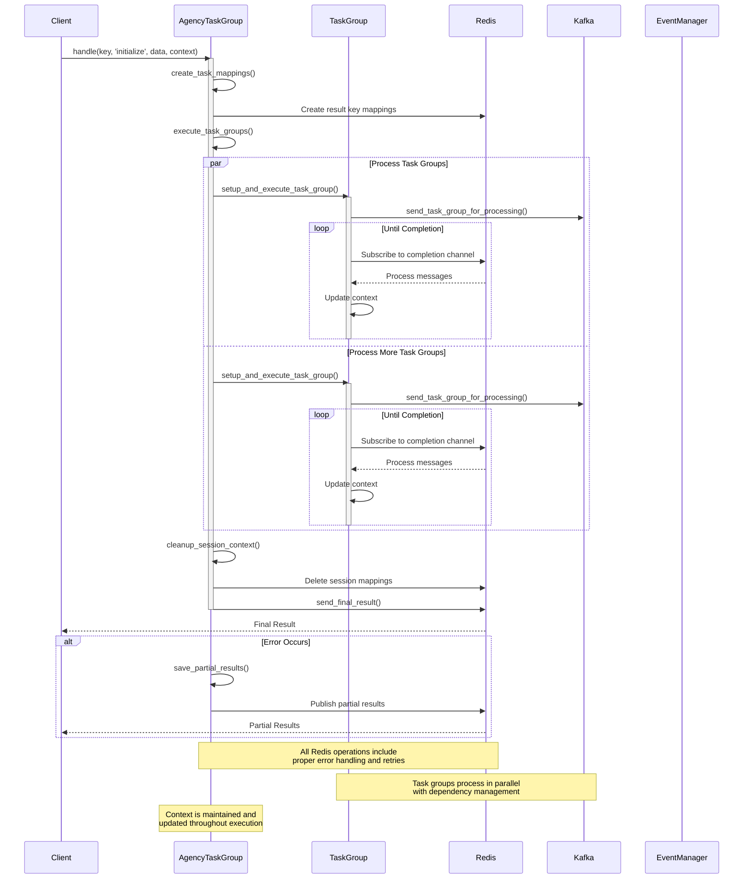

### TaskGroup
- Processes individual tasks with dependency handling
- Manages task expansion and parallel execution
- Handles context updates and result publishing
- Provides error handling and timeout management

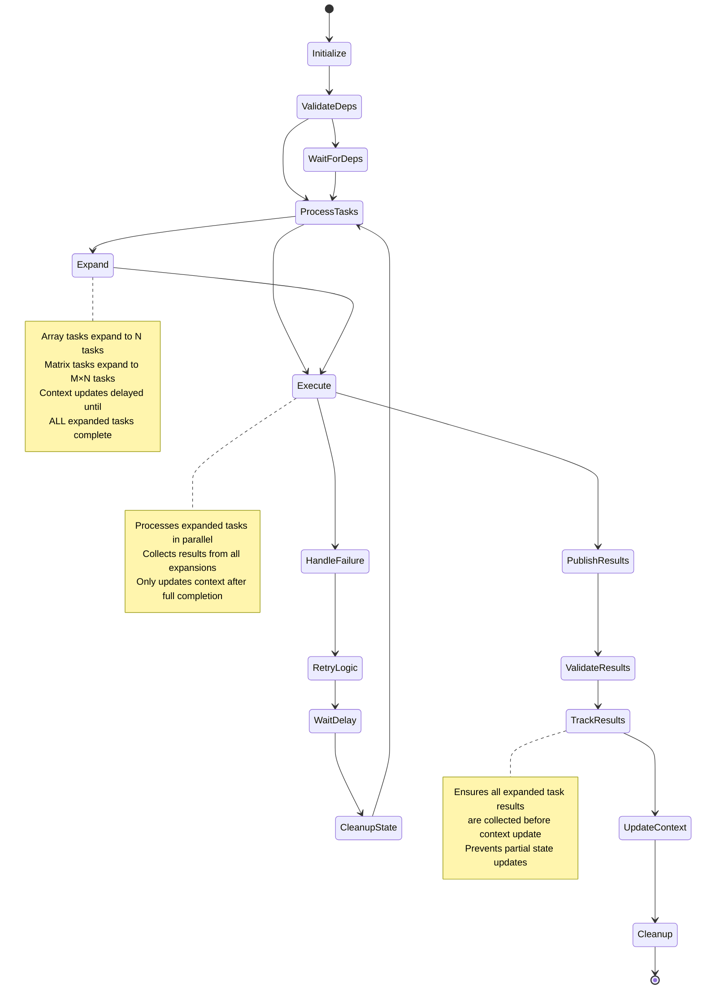

### TaskExpansion  
- Handles dynamic task expansion based on array data
- Supports different output formats (merge, separate, single)
- Manages template variable replacement
- Processes dependencies and context mapping

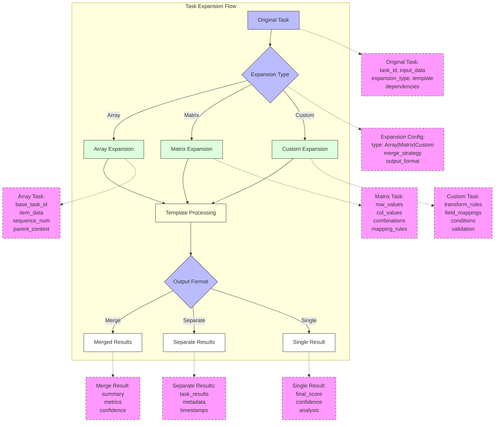

## Task Expansion Components

### Process Nodes (Purple)
- **Original Task**: Entry point for task processing, contains initial configuration and data
- **Expansion Type**: Decision node that determines how tasks will be expanded
- **Output Format**: Controls how results are aggregated and returned

### Expansion Nodes (Green)

#### Array Expansion
- Handles one-dimensional data arrays, creating subtasks for each element
- Works with both simple values and complex objects
- Example with simple values:
```json
{
    "input_array": ["item1", "item2", "item3"],
    "expansion_config": {
        "type": "array",
        "array_mapping": {"input": "input_array"},
        "output_format": "separate"
    }
}
// Expands to 3 tasks, one for each item
```
- Example with objects:
```json
{
    "users": [
        {"id": 1, "name": "Alice", "role": "admin"},
        {"id": 2, "name": "Bob", "role": "user"},
        {"id": 3, "name": "Carol", "role": "user"}
    ],
    "expansion_config": {
        "type": "array",
        "array_mapping": {"user": "users"},
        "output_format": "separate"
    }
}
// Expands to 3 tasks, one per user object
```

#### Matrix Expansion
- Used when you need to process combinations of multiple arrays
- Creates tasks for every possible combination of elements from different arrays
- Useful for:
  - Testing combinations of parameters
  - Cross-product analysis
  - Comparative evaluations
- Processes two-dimensional data, creating tasks for each combination
- Example:
```json
{
    "rows": ["A", "B"],
    "cols": [1, 2, 3],
    "expansion_config": {
        "type": "matrix",
        "array_mapping": {
            "row": "rows",
            "col": "cols"
        }
    }
}
// Expands to 6 tasks: A1, A2, A3, B1, B2, B3
```

#### Custom Expansion
- Supports complex expansion patterns with custom logic
- Example:
```json
{
    "data": {
        "regions": ["US", "EU"],
        "years": [2022, 2023],
        "metrics": ["sales", "growth"]
    },
    "expansion_config": {
        "type": "custom",
        "transform_rules": {
            "combine": ["regions", "metrics"],
            "filter": {"years": ">2021"}
        }
    }
}
// Expands based on custom combination rules
```

### Template Node (Yellow)
- **Template Processing**: Applies templates to expanded tasks, handling variable substitution and formatting

### Output Nodes (White)
- **Merged Results**: Combines all subtask results into a single consolidated output
- **Separate Results**: Maintains individual results for each expanded task
- **Single Result**: Produces a unified output with aggregated metrics

## Object Relationships
- Original tasks flow through expansion types to create subtasks
- Each expansion type uses template processing for consistency
- Results are formatted according to the output configuration
- Context is maintained throughout the expansion process

### EventManager
- Manages event subscriptions and notifications
- Handles Redis and Kafka message processing
- Coordinates communication between components
- Provides error recovery and cleanup

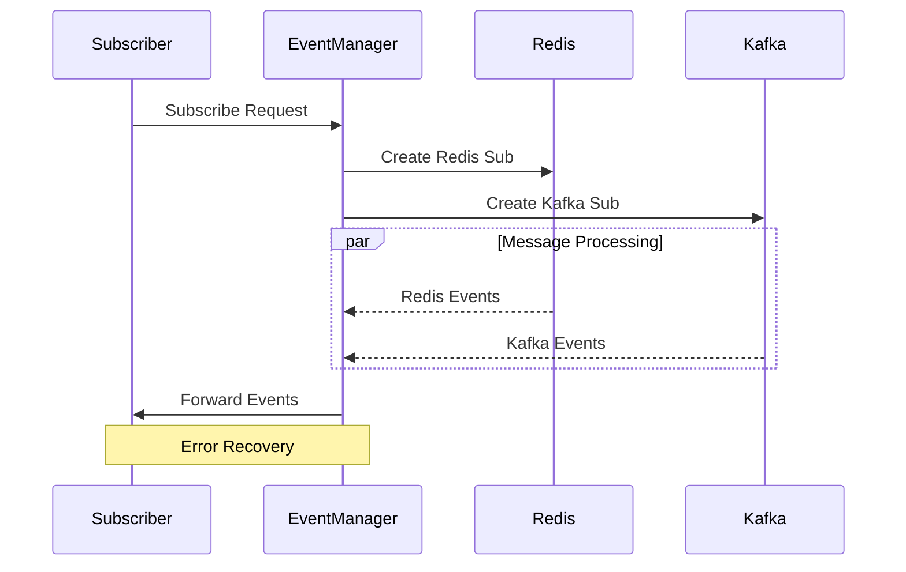

## Task Processing Lifecycle

The task processing system follows a well-defined lifecycle with distinct phases:

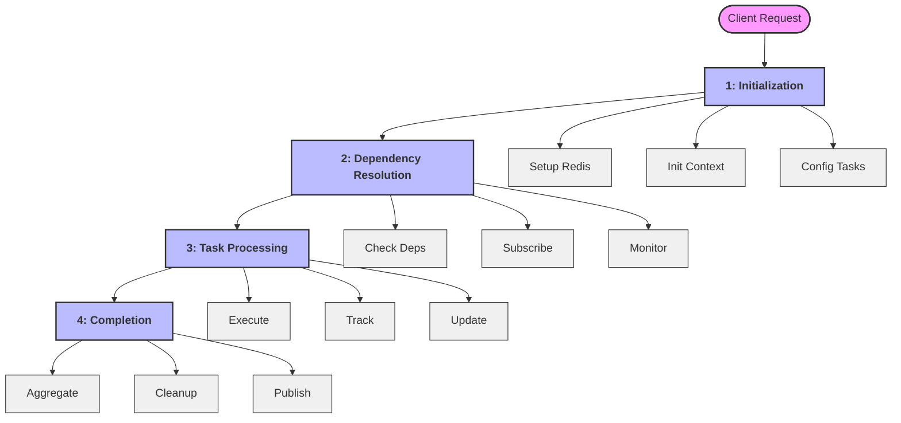

### Phase 1: Initialization

The initialization phase consists of three major components that work together to prepare the task processing system:

#### Major Components

1. **Redis Infrastructure**
   - Handles all distributed state management
   - Manages pub/sub communication channels
   - Provides result storage and tracking
   
2. **Context Management**
   - Maintains execution environment state
   - Manages configuration and settings
   - Handles recovery and backup systems
   
3. **Task Organization**
   - Structures task groups and relationships
   - Manages dependencies and execution order
   - Controls resource allocation and priorities

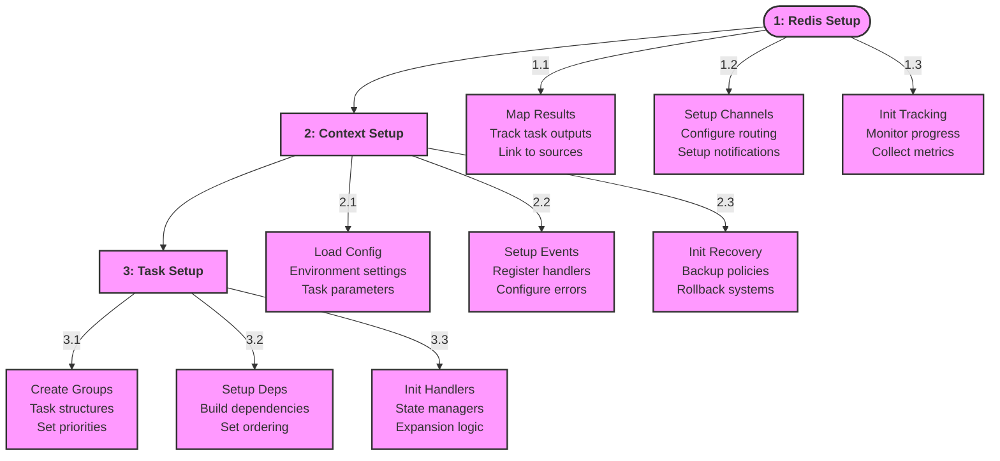

#### Initialization Steps

1. **Redis Setup**
   1. Result Mapping (1.1)
      - Create key mappings for task outputs
      - Link results to their source tasks
      - Setup completion tracking
   
   2. Channel Configuration (1.2) 
      - Create communication channels
      - Configure event routing
      - Setup notification paths
   
   3. Tracking Setup (1.3)
      - Initialize progress monitoring
      - Setup metrics collection
      - Configure state tracking

2. **Context Setup**
   1. Configuration Loading (2.1)
      - Load environment settings
      - Initialize task configs
      - Setup system parameters
   
   2. Event Handler Setup (2.2)
      - Register core handlers
      - Configure error handling
      - Setup state management
   
   3. Recovery Configuration (2.3)
      - Setup recovery policies
      - Configure state backups
      - Initialize rollback systems

3. **Task Setup**
   1. Group Creation (3.1)
      - Create task group structures
      - Allocate resources
      - Set execution priorities
   
   2. Dependency Setup (3.2)
      - Build dependency graphs
      - Configure validation rules
      - Set execution ordering
   
   3. Handler Setup (3.3)
      - Initialize task handlers
      - Setup state managers
      - Configure expansion logic

#### Key Methods
- `create_task_mappings()`: Sets up Redis mappings
- `initialize_context()`: Prepares execution context  
- `setup_task_groups()`: Creates and configures task groups

### Phase 2: Dependency Resolution

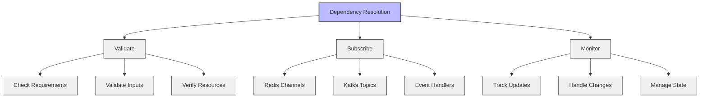

Key Steps:
1. **Validation**
   - Check all required dependencies
   - Validate input formats
   - Verify resource availability

2. **Subscription Setup**  
   - Configure Redis channels
   - Setup Kafka topics
   - Initialize event listeners

3. **Update Monitoring**
   - Track dependency updates
   - Handle state changes
   - Manage completion status

### Phase 3: Task Processing

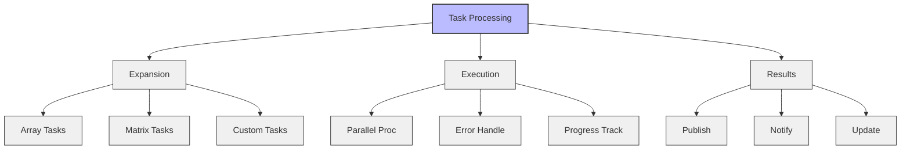

Key Steps:
1. **Task Expansion**
   - Process array tasks
   - Handle matrix expansions
   - Execute custom patterns

2. **Parallel Execution**
   - Run tasks concurrently
   - Handle failures/retries
   - Track task progress

3. **Result Management**
   - Publish to Redis
   - Send notifications
   - Update task context

### Phase 4: Completion

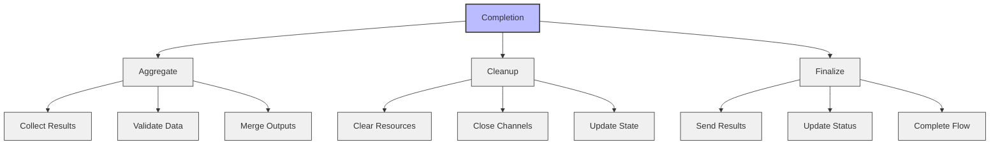

Key Steps:
1. **Result Aggregation**
   - Collect all results
   - Validate completeness
   - Merge task outputs

2. **Resource Cleanup**
   - Release resources
   - Close connections
   - Clear temporary data

3. **Finalization**
   - Send final results
   - Update workflow status
   - Complete processing

## Error Handling
- Timeout management for long-running tasks
- Partial results saved on failures
- Error tracking and recovery mechanisms
- Resource cleanup on failures

## Best Practices
- Use proper dependency declarations
- Handle array data appropriately in expansions
- Clean up resources after task completion
- Monitor task execution timeouts

## Configuration
- Set appropriate timeouts for tasks
- Configure Redis and Kafka connections
- Define proper task expansion settings
- Set up logging and monitoring


## Object Model

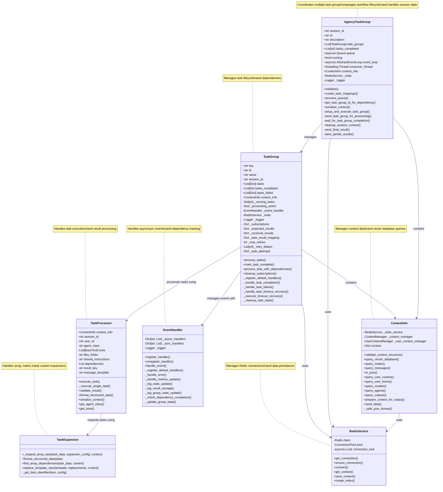