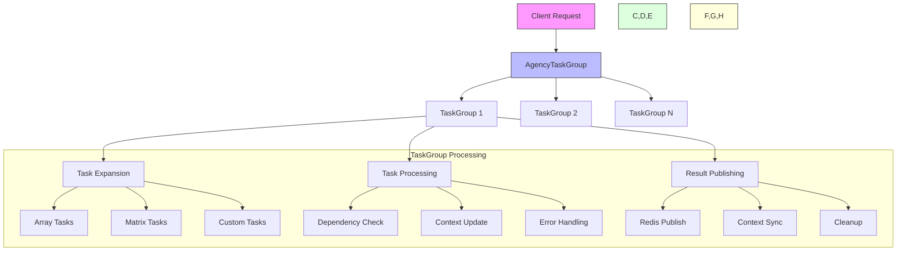
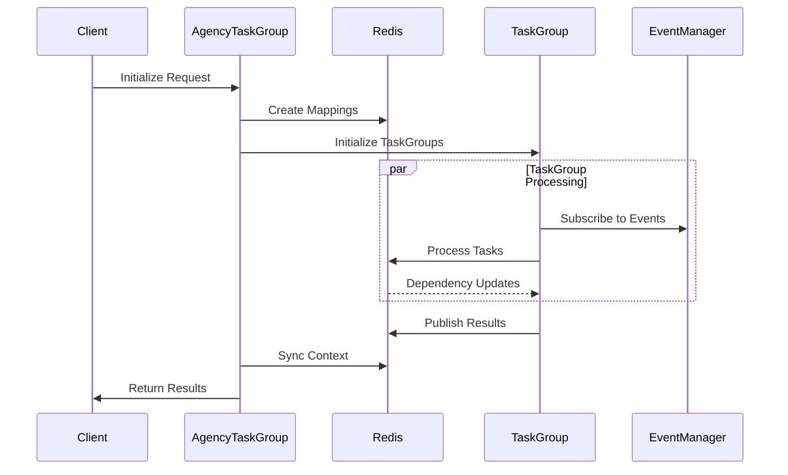
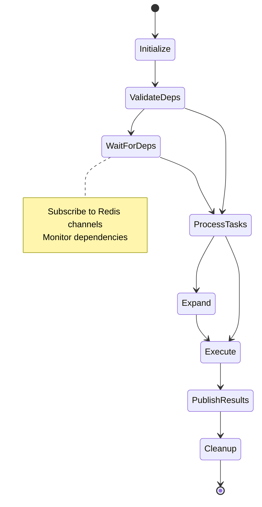
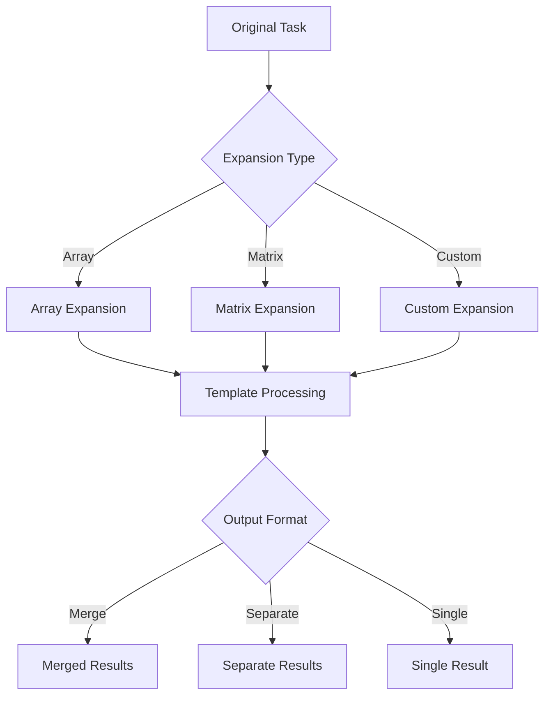
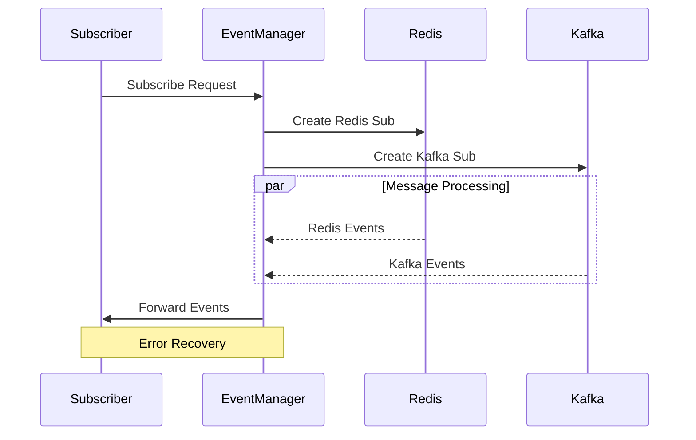
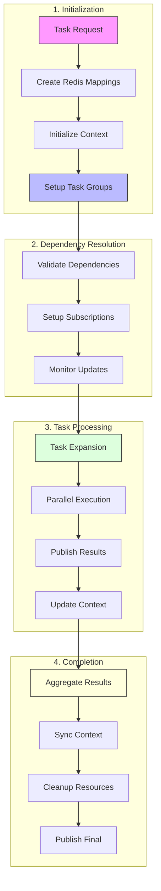

# Task Processing System Documentation

## Overview
The Task Processing System is a distributed task execution framework that handles complex workflows through task groups and dependencies. It consists of several key components that work together to process tasks efficiently and reliably.

## Key Components

### AgencyTaskGroup
- Manages collections of related TaskGroups
- Handles session management and context synchronization  
- Coordinates execution across multiple task groups
- Manages cleanup and completion of task groups

### TaskGroup
- Processes individual tasks with dependency handling
- Manages task expansion and parallel execution
- Handles context updates and result publishing
- Provides error handling and timeout management

### TaskExpansion  
- Handles dynamic task expansion based on array data
- Supports different output formats (merge, separate, single)
- Manages template variable replacement
- Processes dependencies and context mapping

### EventManager
- Manages event subscriptions and notifications
- Handles Redis and Kafka message processing
- Coordinates communication between components
- Provides error recovery and cleanup

## Task Execution Flow

1. **Initialization**
   - AgencyTaskGroup receives task execution request
   - Creates Redis mappings for result keys
   - Initializes task groups with context

2. **Dependency Resolution**
   - TaskGroup validates dependencies
   - Sets up subscriptions for missing dependencies
   - Monitors dependency updates

3. **Task Processing**
   - Tasks are expanded if needed via TaskExpansion
   - Parallel execution of independent tasks
   - Results published to Redis channels
   - Context updated with task results

4. **Completion**
   - Results aggregated and context synchronized
   - Cleanup of Redis mappings and subscriptions
   - Final results published

## Error Handling
- Timeout management for long-running tasks
- Partial results saved on failures
- Error tracking and recovery mechanisms
- Resource cleanup on failures

## Best Practices
- Use proper dependency declarations
- Handle array data appropriately in expansions
- Clean up resources after task completion
- Monitor task execution timeouts

## Configuration
- Set appropriate timeouts for tasks
- Configure Redis and Kafka connections
- Define proper task expansion settings
- Set up logging and monitoring
