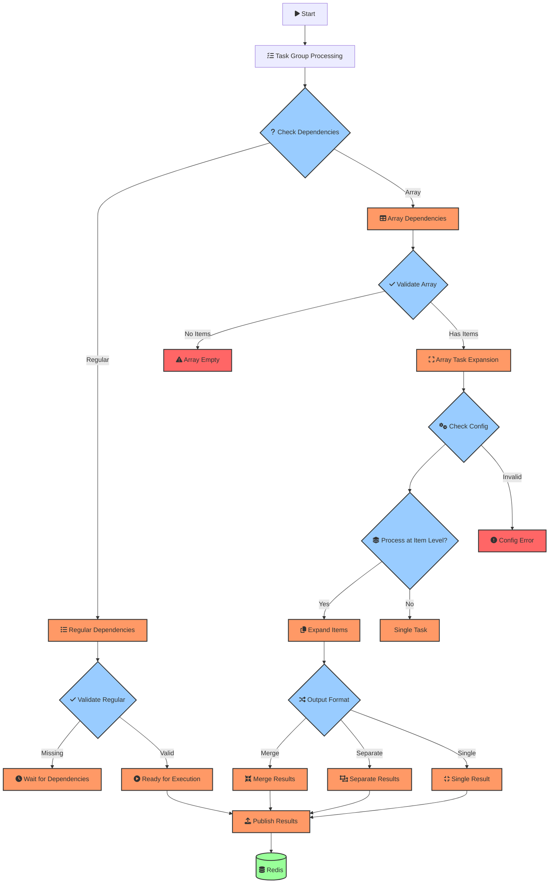

# Array Processing Flow Diagram

This diagram visualizes the array processing workflow in the task group system.

The diagram shows:

1. Initial task group processing
2. Dependency detection and validation
3. Array task expansion based on configuration
4. Different output format handling
5. Result publishing to Redis

Key components are color-coded:
- Orange: Processing steps
- Blue: Decision points
- Green: Data storage
- Red: Error conditions

Font Awesome icons are used to make the diagram more intuitive and visually appealing.
