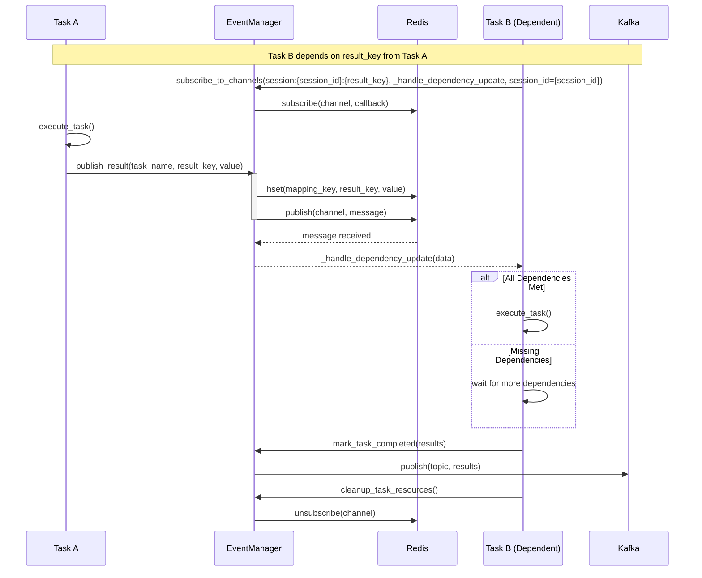

```mermaid
sequenceDiagram
    participant Task1 as Task A
    participant EM as EventManager
    participant Redis
    participant Task2 as Task B (Dependent)
    participant Kafka

    Note over Task1,Kafka: Task B depends on result_key from Task A

    %% Initial Setup
    Task2->>EM: subscribe_to_channels(session:{session_id}:{result_key}, _handle_dependency_update, session_id={session_id})
    EM->>Redis: subscribe(channel, callback)
    
    %% Task Execution & Result Publishing
    Task1->>Task1: execute_task()
    Task1->>EM: publish_result(task_name, result_key, value)
    
    activate EM
    EM->>Redis: hset(mapping_key, result_key, value)
    EM->>Redis: publish(channel, message)
    deactivate EM
    
    %% Result Processing
    Redis-->>EM: message received
    EM-->>Task2: _handle_dependency_update(data)
    
    alt All Dependencies Met
        Task2->>Task2: execute_task()
    else Missing Dependencies
        Task2->>Task2: wait for more dependencies
    end

    %% Task Completion
    Task2->>EM: mark_task_completed(results)
    EM->>Kafka: publish(topic, results)
    
    %% Cleanup
    Task2->>EM: cleanup_task_resources()
    EM->>Redis: unsubscribe(channel)
```