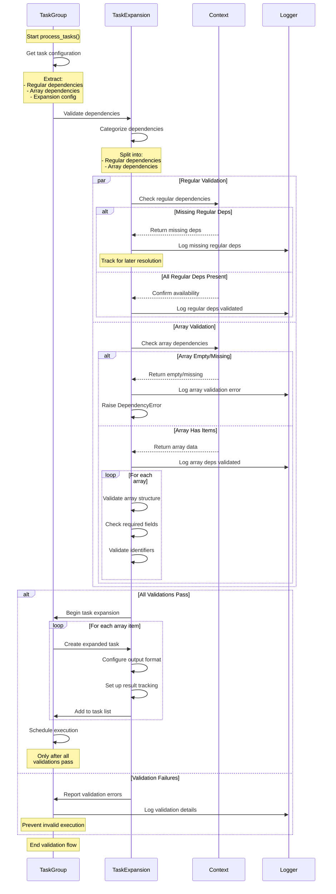

# Task Dependency Validation Flow

The diagram illustrates the updated dependency validation process:

1. Initial Task Processing
   - TaskGroup begins processing "Retrieve Supplemental Information"
   - Task requires both regular and array dependencies
   - Dependencies are categorized upfront

2. Dependency Categorization
   - Regular dependencies identified: ["intake_info"]
   - Array dependencies identified: ["conditions"]
   - Logging provides visibility into categorization

3. Array Processing
   - Array dependencies processed for expansion
   - Tasks expanded based on array items
   - Output format configured per task

4. Execution Flow
   - Regular dependencies checked during execution
   - Array dependencies handled during expansion
   - Better separation of concerns

This new flow allows task expansion to proceed even if regular dependencies aren't yet available, while still ensuring proper validation during actual task execution.
