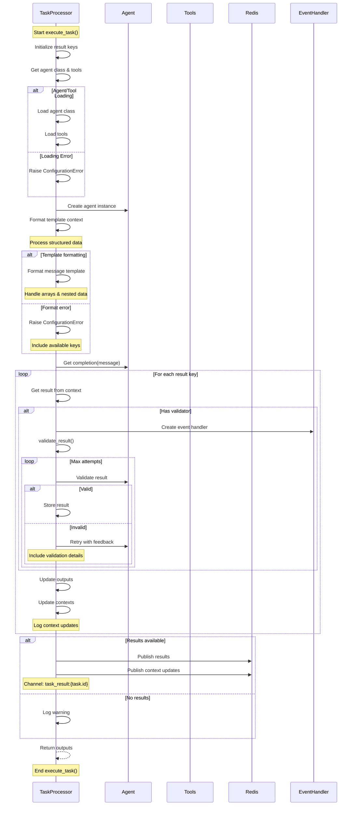

# TaskProcessor.execute_task() Flow

The diagram shows:

1. Task Setup
   - Initialize results
   - Get agent and tools
   - Format context

2. Template Processing
   - Format structured data
   - Handle template variables
   - Error handling

3. Task Execution
   - Agent completion
   - Result validation
   - Context updates

4. Result Handling
   - Validation loop
   - Context updates
   - Redis publishing
