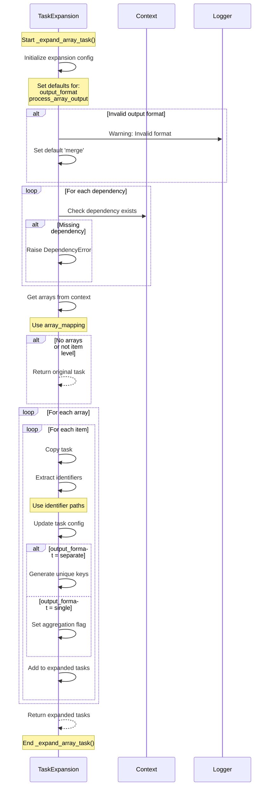

# TaskExpansion._expand_array_task() Flow

The diagram shows:

1. Configuration Setup
   - Initialize defaults
   - Validate settings
   - Check dependencies

2. Array Processing
   - Get arrays from context
   - Check processing mode
   - Handle empty cases

3. Task Expansion
   - Process each array item
   - Extract identifiers
   - Configure output format

4. Result Generation
   - Handle different formats
   - Create task copies
   - Set up aggregation
