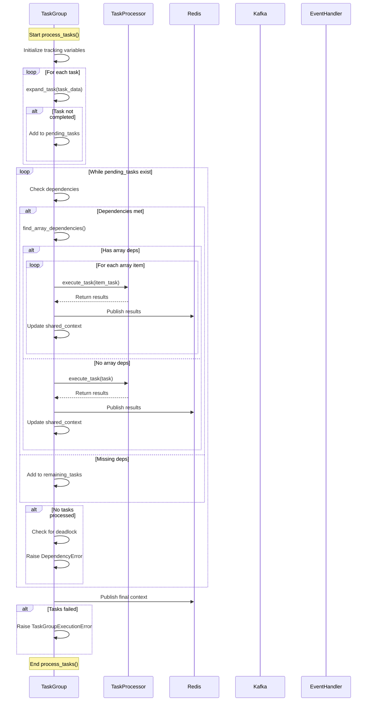

# TaskGroup.process_tasks() Flow

The diagram shows:

1. Task Group Initialization
   - Setup tracking variables
   - Expand initial tasks

2. Task Processing Loop
   - Check dependencies
   - Handle array dependencies
   - Execute tasks
   - Update context
   - Publish results

3. Error Handling
   - Deadlock detection
   - Task failure tracking
   - Context validation

4. Result Publishing
   - Update Redis
   - Final context publication
