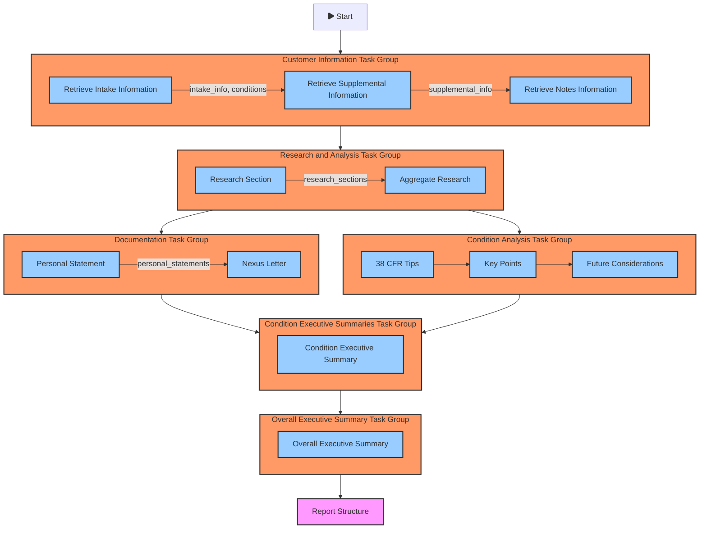
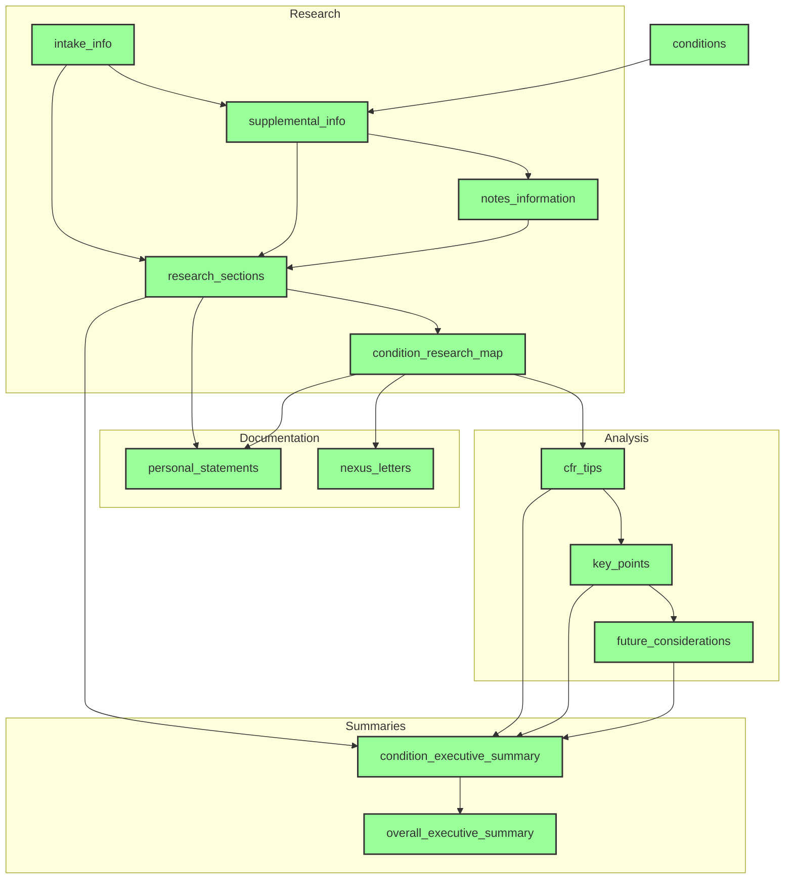
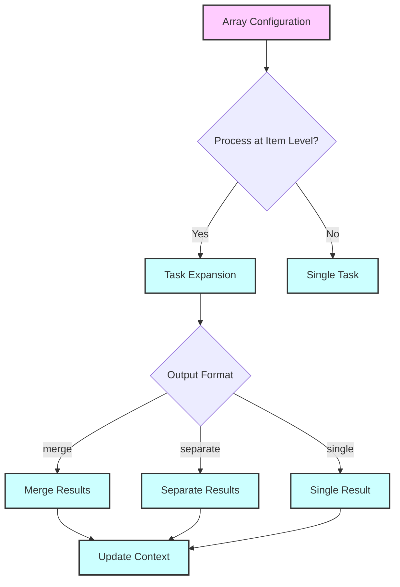

# Task Group Use Cases Flow

## Task Group Dependencies

## Array Processing Configuration

## Key Features

1. **Modular Task Groups**
   - Each group has a specific focus
   - Clear input/output dependencies
   - Supports parallel processing where possible

2. **Flexible Array Processing**
   - Configurable item-level processing
   - Multiple output format options
   - Identifier tracking for results

3. **Context Management**
   - Shared context between tasks
   - Dependency validation
   - Result aggregation

4. **Error Handling**
   - Validation at multiple levels
   - Dependency checking
   - Result verification

## Common Use Cases

1. **Customer Information Collection**
   - Process intake forms
   - Handle supplemental documents
   - Aggregate notes and records

2. **Research and Analysis**
   - Condition-specific research
   - Evidence aggregation
   - Source verification

3. **Documentation Generation**
   - Personal statements
   - Nexus letters
   - Supporting documentation

4. **Report Generation**
   - Executive summaries
   - Condition analysis
   - Final report compilation
