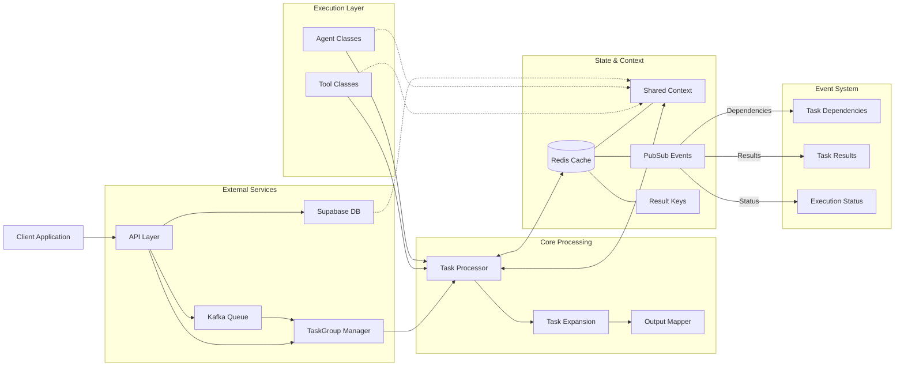
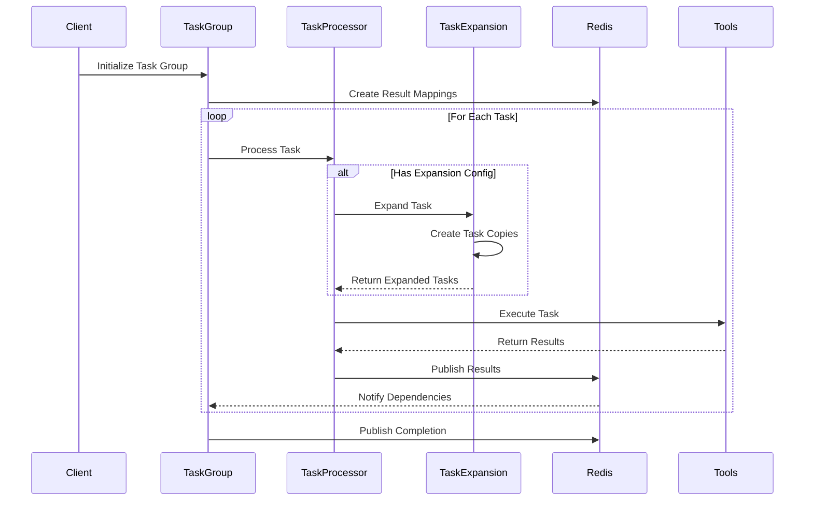
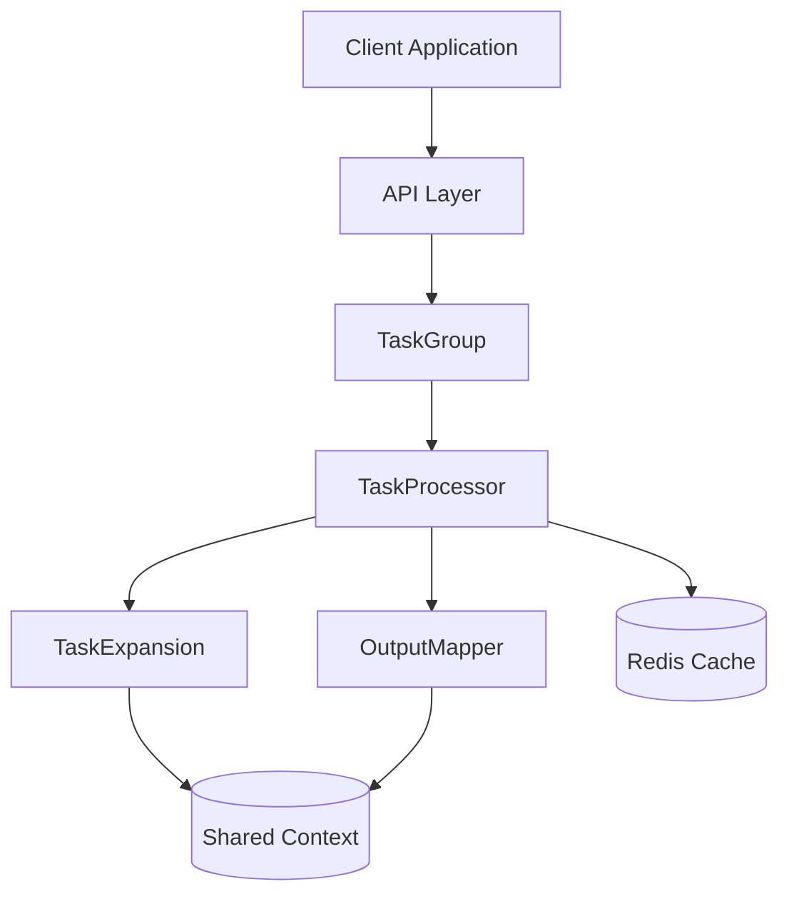
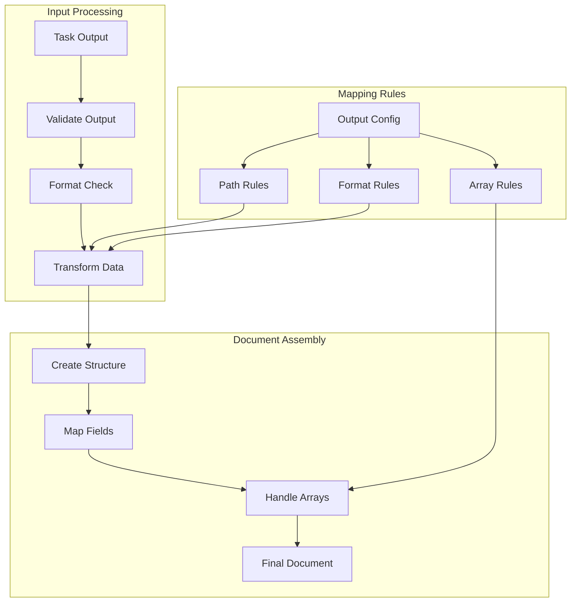
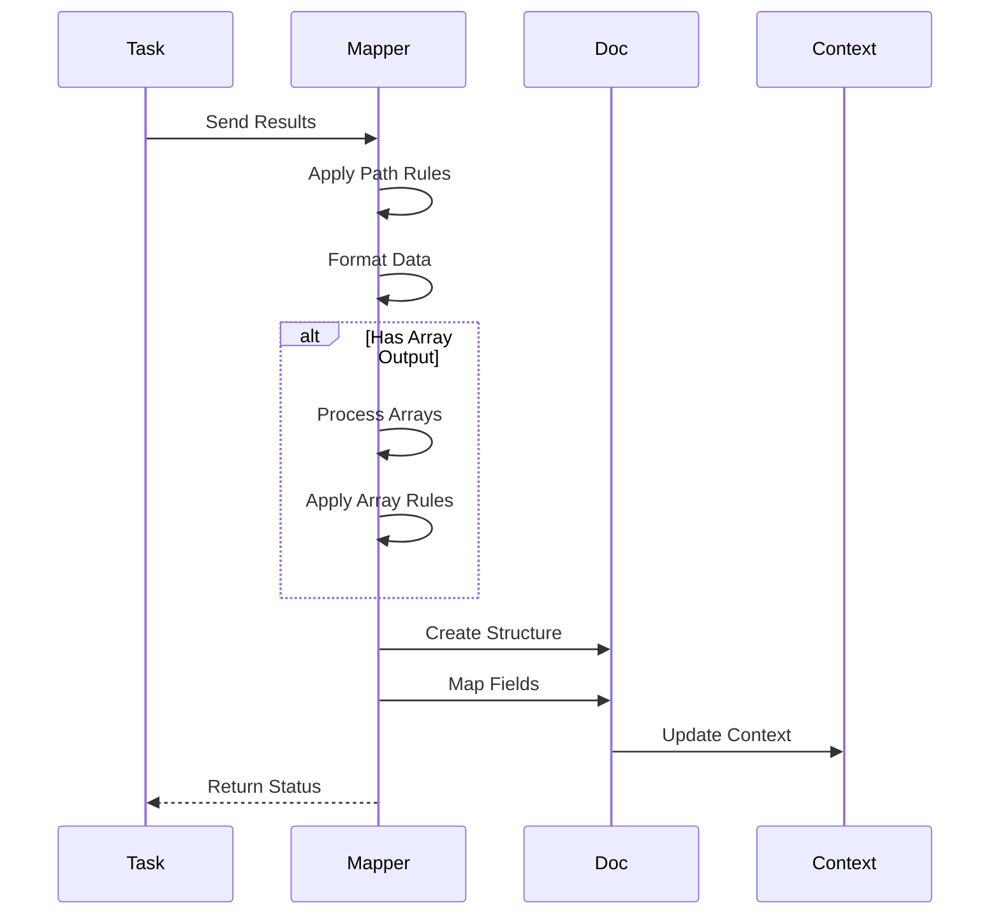
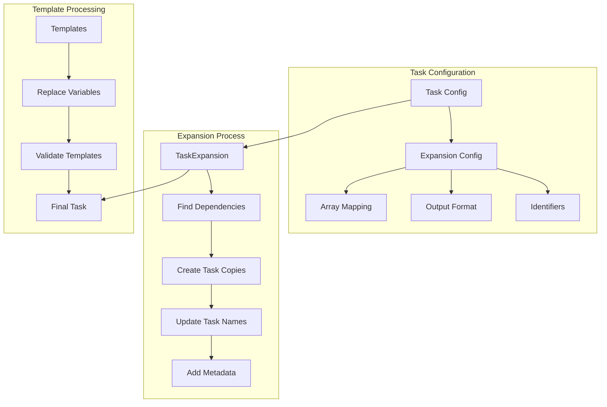
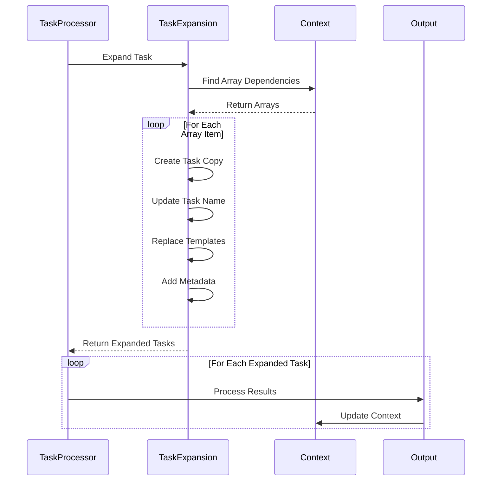
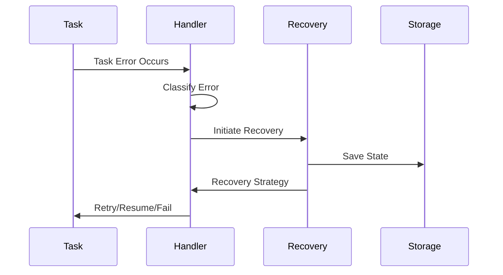

# Task Processing System Documentation

This comprehensive guide covers the task processing system, including task expansion, output mapping, and best practices for task builders.

## Table of Contents

1. Overview
   - System Purpose
   - Key Components
   - Architecture Design

2. Task Building Guide
   - Task Structure
   - Configuration Options
   - Dependencies Management
   - Template Variables
   - Validation Rules

3. Task Expansion System
   - Array-based Expansion
   - Template Processing
   - Metadata Handling
   - Output Configuration
   - Error Handling

4. Output Mapping
   - Document Structure
   - Mapping Syntax
   - Array Handling
   - Nested Fields
   - Format Control

5. Process Workflows
   - Task Initialization
   - Dependency Analysis
   - Expansion Process
   - Template Processing
   - Output Mapping
   - Result Management
   - Error Handling

6. Best Practices
   - Task Design
   - Dependency Management
   - Output Configuration
   - Document Structure
   - Error Handling
   - Performance Optimization

7. Examples & Templates
   - Basic Task Configuration
   - Array Expansion
   - Output Mapping
   - Complete Workflows
   - Common Patterns

8. Troubleshooting
   - Common Issues
   - Debugging Tips
   - Error Messages
   - Resolution Steps

## 1. Overview

The Task Processing System is a distributed workflow engine that handles complex task execution with dynamic expansion capabilities and structured output mapping. It enables the processing of tasks that can expand based on array data while maintaining proper dependency management and context sharing across task groups.

### System Architecture Diagram



### Core Purpose and Goals

- **Dynamic Task Processing**: Execute tasks that can expand based on input arrays
- **Dependency Management**: Handle complex task dependencies and ensure proper execution order
- **Context Sharing**: Maintain shared context across task groups and expanded tasks
- **Structured Output**: Map task results into well-defined document structures
- **Scalability**: Support parallel processing of independent tasks
- **Reliability**: Ensure consistent task execution and error handling

### System Boundaries and Integration Points

- **External Interfaces**:
  - Redis PubSub for event distribution
  - Kafka for task queue management
  - Supabase for persistent storage
  - REST APIs for client communication

- **Integration Boundaries**:
  - Task Group Layer: Handles high-level workflow orchestration
  - Task Processing Layer: Manages individual task execution
  - Storage Layer: Handles persistence and caching
  - Event Layer: Manages message distribution

- **Security Boundaries**:
  - Authentication boundary at API layer
  - Authorization checks at task execution
  - Data isolation between sessions
  - Secure context sharing mechanisms

### Task Processing Flow



### System Architecture

The system is built around several key components that work together to process tasks:



### Key Components

1. **TaskGroup**
   - Manages collections of related tasks
   - Handles dependency resolution
   - Coordinates parallel task execution
   - Maintains task group context

2. **TaskProcessor**
   - Executes individual tasks
   - Manages task expansion
   - Handles result processing
   - Integrates with agents and tools

3. **TaskExpansion**
   - Handles array-based task expansion
   - Manages template variables
   - Tracks expansion metadata
   - Ensures proper result mapping

4. **OutputMapper**
   - Maps task results to document structure
   - Handles array output formatting
   - Manages nested field mapping
   - Validates output structure

### Core Concepts

1. **Task Expansion**
   - Tasks can expand based on array dependencies
   - Each expanded task maintains its own context
   - Results can be merged or kept separate
   - Metadata tracks expansion relationships

2. **Dependency Management**
   - Tasks specify their dependencies explicitly
   - System tracks dependency availability
   - Redis handles dependency notifications
   - Circular dependencies are prevented

3. **Context Sharing**
   - Context is shared within task groups
   - Expanded tasks inherit parent context
   - Results update shared context
   - Context synchronization across groups

4. **Result Mapping**
   - Results map to structured documents
   - Support for nested field mapping
   - Array results can be merged
   - Output validation ensures consistency

## 2. Task Building Guide

The Task Building Guide provides comprehensive documentation for configuring tasks within the system. This section covers all aspects of task configuration, from basic setup to advanced features.

### Task Configuration Structure

Tasks are configured using a standardized JSON structure that defines their behavior, dependencies, and output handling:

```json
{
  "name": "string",                    // Unique task identifier
  "agent_class": "string",             // Agent implementation to use
  "shared_instructions": "string",      // Task-specific instructions
  "message_template": "string",        // Template with variable placeholders
  "result_keys": ["string"],           // Expected output keys
  "tools": ["string"],                 // Required tools
  "dependencies": ["string"],          // Input dependencies
  "expansion_config": {                // Optional expansion settings
    "type": "array",
    "array_mapping": {},
    "identifiers": {},
    "output_format": "string"
  }
}
```

### Required Fields

1. **name** (string)
   - Unique identifier for the task
   - Used for dependency tracking
   - Must be unique within task group
   - Example: "ProcessCustomerData"

2. **agent_class** (string)
   - Specifies the agent implementation
   - Must reference existing agent class
   - Determines processing behavior
   - Example: "DataProcessingAgent"

3. **message_template** (string)
   - Template string with variables
   - Variables use {placeholder} syntax
   - References context values
   - Example: "Process data for {customer_id}"

4. **result_keys** (array)
   - Expected output key names
   - Used for dependency tracking
   - Must be unique across tasks
   - Example: ["customer_data", "analysis_results"]

### Optional Fields

1. **shared_instructions** (string)
   - Additional processing instructions
   - Guides agent behavior
   - Can reference context
   - Example: "Include all customer history"

2. **tools** (array)
   - Required tool implementations
   - Must reference existing tools
   - Example: ["DataProcessor", "Analyzer"]

3. **dependencies** (array)
   - Required input dependencies
   - References other task outputs
   - Example: ["raw_data", "config_settings"]

4. **expansion_config** (object)
   - Array expansion settings
   - Controls output handling
   - Example: See Array Expansion section

### Template Variables

Template variables in message_template and shared_instructions use {placeholder} syntax:

1. **Context Variables**
   - Reference shared context
   - Example: {user_id}
   - Must exist in context

2. **Array Variables**
   - Used in expanded tasks
   - Example: {item.id}
   - Available during expansion

3. **System Variables**
   - Built-in values
   - Example: {task_id}
   - Always available

### Dependency Configuration

Dependencies define task execution order and data flow:

1. **Direct Dependencies**
   ```json
   {
     "dependencies": ["task_a_output", "task_b_output"]
   }
   ```

2. **Array Dependencies**
   ```json
   {
     "dependencies": ["items_array"],
     "expansion_config": {
       "array_mapping": {
         "item": "items_array"
       }
     }
   }
   ```

3. **Optional Dependencies**
   ```json
   {
     "dependencies": ["optional_data?"]
   }
   ```

### Error Handling

Tasks should implement proper error handling:

1. **Missing Dependencies**
   - System waits for dependencies
   - Timeout after configured period
   - Logs dependency errors

2. **Processing Errors**
   - Captured in task results
   - Logged for debugging
   - May trigger retries

3. **Validation Errors**
   - Check input/output format
   - Validate dependencies
   - Ensure required fields

### Best Practices

1. **Naming Conventions**
   - Use descriptive task names
   - Follow consistent patterns
   - Include purpose in name

2. **Dependencies**
   - Minimize dependencies
   - Use clear naming
   - Document relationships

3. **Templates**
   - Keep templates simple
   - Document variables
   - Handle missing values

4. **Error Handling**
   - Implement validation
   - Log errors clearly
   - Plan for failures

## Output Mapping System

The Output Mapping system provides a flexible way to transform task results into structured documents. It handles array outputs, nested fields, and maintains consistent document structure across task groups.

### Document Structure

The system uses a hierarchical document structure:

### Output Mapping Architecture



### Document Structure Flow



```json
{
  "result_key": "string", 
  "path": "$.nested.field.path",
  "data": {
    "field1": "value1",
    "array_field": [
      {"id": 1, "value": "item1"},
      {"id": 2, "value": "item2"}
    ],
    "nested": {
      "field": {
        "path": "nested_value"
      }
    }
  }
}
```

### Mapping Syntax

The system uses JSONPath-style syntax for mapping:

1. **Basic Mapping**
   ```json
   {
     "output_path": "$.field_name"
   }
   ```

2. **Array Indexing**
   ```json
   {
     "output_path": "$.array_field[{index}]"
   }
   ```

3. **Nested Fields**
   ```json
   {
     "output_path": "$.parent.child.field"
   }
   ```

### Array Output Handling

Array outputs can be handled in several ways:

1. **Merge Mode**
   - Combines results into single array
   - Preserves order of items
   - Handles duplicates

2. **Separate Mode**
   - Keeps results as separate arrays
   - Maintains array boundaries
   - Better for parallel processing

3. **Index Mode**
   - Maps items to specific indices
   - Uses array metadata
   - Supports sparse arrays

Example configuration:
```json
{
  "expansion_config": {
    "type": "array",
    "output_format": "merge|separate|index",
    "array_mapping": {
      "items": "source_array"
    }
  }
}
```

### Nested Field Mapping

The system supports complex nested structures:

1. **Deep Object Paths**
   ```json
   {
     "output_path": "$.level1.level2.level3"
   }
   ```

2. **Array of Objects**
   ```json
   {
     "output_path": "$.items[{index}].properties.value"
   }
   ```

3. **Conditional Mapping**
   ```json
   {
     "output_path": "$.items[?(@.type=='specific')].value"
   }
   ```

### Format Control

Output format can be controlled through configuration:

1. **Data Types**
   ```json
   {
     "format": {
       "type": "string|number|boolean|array|object",
       "nullable": true
     }
   }
   ```

2. **Array Formats**
   ```json
   {
     "format": {
       "type": "array",
       "items": {
         "type": "object",
         "properties": {...}
       }
     }
   }
   ```

3. **Validation Rules**
   ```json
   {
     "format": {
       "validate": {
         "required": ["field1", "field2"],
         "pattern": "regex_pattern"
       }
     }
   }
   ```

### Best Practices

1. **Path Design**
   - Use clear, descriptive paths
   - Follow consistent naming
   - Document path structure

2. **Array Handling**
   - Choose appropriate format
   - Consider order requirements
   - Handle edge cases

3. **Validation**
   - Define required fields
   - Validate data types
   - Check constraints

4. **Performance**
   - Minimize nesting depth
   - Batch array operations
   - Cache frequent paths

## 5. Process Workflows

The Process Workflows section details the complete lifecycle of task processing, from initialization through completion. This section covers the key processes, their interactions, and best practices for implementation.

### 5.1 Task Initialization

The initialization process prepares tasks and their environment:

1. **Configuration Validation**
   ```json
   {
     "name": "ProcessData",
     "agent_class": "DataProcessor",
     "result_keys": ["processed_data"],
     "dependencies": ["raw_data"],
     "expansion_config": {
       "type": "array",
       "array_mapping": {
         "data_item": "data_array"
       }
     }
   }
   ```

   - Validate all required fields
   - Check configuration completeness
   - Verify agent class exists
   - Validate tool references

2. **Context Setup**
   ```json
   {
     "session_id": "abc123",
     "task_group_id": "tg456",
     "shared_context": {
       "user_id": "user789",
       "settings": {...}
     }
   }
   ```

   - Initialize shared context
   - Set up session tracking
   - Configure Redis mappings
   - Initialize monitoring

3. **Resource Allocation**
   - Create Redis connections
   - Set up event subscriptions
   - Initialize task queues
   - Configure logging

### 5.2 Dependency Management

The system implements a sophisticated dependency management system using Redis for real-time updates and synchronization:

1. **Dependency Tracking**
   ```json
   {
     "session_id": "abc123",
     "result_keys": {
       "data_key": {
         "task_group_id": "tg123",
         "task_name": "ProcessData",
         "timestamp": 1234567890,
         "dependencies": ["raw_data"]
       }
     }
   }
   ```

2. **Resolution Process**
   - Redis mappings track result key ownership
   - Real-time dependency notifications via Redis PubSub
   - Asynchronous subscription management
   - Cross-task-group dependency resolution
   - Session-level context synchronization

3. **Validation System**
   ```json
   {
     "validation": {
       "check_dependencies": true,
       "validate_result_keys": true,
       "track_completion": true,
       "verify_context": true
     }
   }
   ```

4. **Dependency States**
   - **Pending**: Dependency not yet available
   - **Ready**: Dependency value present in context
   - **Failed**: Dependency resolution failed
   - **Timeout**: Dependency wait exceeded timeout

5. **Context Management**
   ```json
   {
     "context_sync": {
       "session_id": "abc123",
       "task_group_id": "tg123",
       "context_keys": ["key1", "key2"],
       "timestamp": 1234567890
     }
   }
   ```

6. **Subscription Handling**
   - Dynamic channel subscription based on dependencies
   - Automatic cleanup of completed subscriptions
   - Error handling for failed subscriptions
   - Message queue management per channel

7. **Cross-Task-Group Resolution**
   ```json
   {
     "dependency_resolution": {
       "source_task_group": "tg123",
       "target_task_group": "tg456",
       "dependency_key": "data_key",
       "status": "pending"
     }
   }
   ```

8. **Error Handling**
   - Missing dependency detection
   - Circular dependency prevention
   - Timeout management
   - Partial result handling
   - Recovery procedures

9. **Best Practices**
   - Use explicit dependency declarations
   - Implement timeout handling
   - Monitor dependency health
   - Clean up completed subscriptions
   - Validate context updates

### 5.3 Task Expansion

Handles array-based task expansion:

1. **Array Analysis**
   ```json
   {
     "expansion_config": {
       "type": "array",
       "array_mapping": {
         "item": "source_array"
       },
       "output_format": "merge"
     }
   }
   ```

2. **Task Generation**
   - Create task copies
   - Update task names
   - Configure result mapping
   - Set up monitoring

3. **Template Processing**
   ```json
   {
     "template": "Process item {item.id}",
     "variables": {
       "item": {
         "id": "123",
         "data": {...}
       }
     }
   }
   ```

### 5.4 Execution Flow

Manages the task execution lifecycle:

1. **Task Processing**
   ```mermaid
   sequenceDiagram
       participant TG as TaskGroup
       participant TP as TaskProcessor
       participant TE as TaskExpansion
       participant Redis
    
       TG->>TP: execute_task(TaskInfo)
       TP->>TP: Check expansion_config
    
       alt Has expansion_config
           TP->>TE: _expand_array_task(task, config, context)
           TE->>TE: find_array_dependencies(task, context)
        
           loop For each array item
               TE->>TE: Create expanded task copy
               Note over TE: Update task name with identifier
               Note over TE: Replace template variables
               Note over TE: Add array metadata
           end
        
           TE-->>TP: Return expanded tasks
        
           loop For each expanded task
               TP->>TP: Process with agent
               TP->>Redis: Publish results
           end
       else
           TP->>TP: Process single task
           TP->>Redis: Publish results
       end
    
       TP-->>TG: Return final results
   ```

2. **State Management**
   - Track task status
   - Handle state transitions
   - Manage task timeouts
   - Record completion status

3. **Result Processing**
   ```json
   {
     "task_id": "task123",
     "status": "completed",
     "results": {
       "output_key": "value",
       "metrics": {...}
     }
   }
   ```

### 5.5 Error Handling

Comprehensive error management:

1. **Error Types**
   ```json
   {
     "error": {
       "type": "TaskExecutionError",
       "code": "EXEC_001",
       "message": "Task execution failed",
       "details": {
         "task_id": "task123",
         "stage": "processing",
         "error_data": {...}
       }
     }
   }
   ```

2. **Recovery Procedures**
   - Save partial results
   - Clean up resources
   - Notify systems
   - Log error details

3. **Retry Mechanisms**
   ```json
   {
     "retry_config": {
       "max_attempts": 3,
       "delay": 1000,
       "backoff": 2.0,
       "timeout": 30000
     }
   }
   ```

### 5.6 Resource Management

Handles system resources:

1. **Redis Operations**
   ```json
   {
     "redis_config": {
       "key_prefix": "task:",
       "expiry": 3600,
       "max_memory": "100mb"
     }
   }
   ```

2. **Context Management**
   - Track resource usage
   - Clean up expired data
   - Monitor memory usage
   - Handle resource limits

3. **Cleanup Procedures**
   ```json
   {
     "cleanup_config": {
       "stages": {
         "pre_execution": {
           "actions": [
             "Clear stale session data",
             "Remove expired keys",
             "Reset task state"
           ]
         },
         "post_execution": {
           "actions": [
             "Clear temporary results",
             "Remove completed task data",
             "Archive session context"
           ]
         },
         "error_cleanup": {
           "actions": [
             "Save partial results",
             "Clear failed task state",
             "Log cleanup errors"
           ]
         }
       },
       "triggers": {
         "task_completion": true,
         "session_end": true,
         "error_occurred": true,
         "memory_threshold": "80%"
       },
       "retention": {
         "session_data": "24h",
         "task_results": "12h",
         "error_logs": "7d"
       }
     }
   }
   ```

### 5.7 Monitoring

System monitoring and metrics:

1. **Performance Metrics**
   ```json
   {
     "metrics": {
       "task_duration": 1234,
       "memory_usage": "45mb",
       "dependency_wait": 100,
       "error_count": 0
     }
   }
   ```

2. **Health Checks**
   - System connectivity
   - Resource availability
   - Error rates
   - Performance thresholds

3. **Alerting Rules**
   ```json
   {
     "alerts": {
       "error_rate": ">1%",
       "task_duration": ">30s",
       "memory_usage": ">80%"
     }
   }
   ```

### 5.8 Integration Points

System integration details:

1. **Event Publishing**
   ```json
   {
     "event": {
       "type": "task_status",
       "task_id": "task123",
       "status": "completed",
       "timestamp": "2024-01-01T00:00:00Z",
       "data": {...}
     }
   }
   ```

2. **External Systems**
   - Status updates
   - Result publishing
   - Error reporting
   - Metric collection

3. **API Contracts**
   ```json
   {
     "api": {
       "version": "1.0",
       "endpoints": {
         "task_status": "/api/tasks/{task_id}/status",
         "task_result": "/api/tasks/{task_id}/result"
       }
     }
   }
   ```

### Best Practices

1. **Configuration**
   - Use clear naming conventions
   - Validate all inputs
   - Document dependencies
   - Handle defaults safely

2. **Error Handling**
   - Implement proper retries
   - Log error details
   - Clean up resources
   - Notify systems appropriately

3. **Performance**
   - Monitor resource usage
   - Optimize Redis operations
   - Handle concurrent tasks
   - Implement timeouts

4. **Integration**
   - Use standard formats
   - Validate API contracts
   - Handle version changes
   - Document interfaces

## Task Group Dependencies and Tool Relationships

The system implements a hierarchical task group structure with well-defined dependencies and tool relationships. Each task group serves a specific purpose in the workflow and uses specialized tools to process and transform data.

### Task Group Structure

1. **Retrieve Customer Information**
   - Purpose: Gather and process initial customer data
   - Tools:
     - SaveIntakeInformation: Processes initial intake forms
     - AggregateIntakes: Combines multiple intake sources
     - SaveNotesInformation: Processes customer notes
   - Dependencies: None (Initial task group)
   - Outputs: intake_info, supplemental_info, notes_information

2. **Research and Analysis**
   - Purpose: Conduct research based on customer conditions
   - Tools:
     - WriteResearchSection: Documents research findings
   - Dependencies: 
     - intake_info
     - supplemental_info
     - notes_information
   - Outputs: research_sections

3. **Documentation**
   - Purpose: Generate customer-facing documents
   - Tools:
     - WritePersonalStatement: Creates personalized narratives
     - WriteNexusLetter: Generates supporting documentation
   - Dependencies:
     - research_sections
     - intake_info
     - supplemental_info
     - notes_information
   - Outputs: personal_statement, nexus_letters

4. **Condition Analysis**
   - Purpose: Analyze conditions and provide guidance
   - Tools:
     - Write38CFRPoints: Documents regulatory points
     - WriteKeyPoints: Highlights critical information
     - WriteFutureConsiderations: Plans next steps
   - Dependencies:
     - research_sections
     - intake_info
     - supplemental_info
     - notes_information
   - Outputs: cfr_tips, key_points, future_considerations

5. **Condition Executive Summaries**
   - Purpose: Summarize findings per condition
   - Tools:
     - WriteExecutiveSummary: Creates condition summaries
   - Dependencies:
     - All previous outputs
   - Outputs: condition_executive_summaries

6. **CreateConditionSections**
   - Purpose: Compile final report sections
   - Tools:
     - WriteConditionReportSection: Assembles section content
   - Dependencies:
     - condition_executive_summaries
   - Outputs: condition_sections

7. **Overall Executive Summary**
   - Purpose: Create report overview
   - Tools:
     - WriteExecutiveSummary: Generates final summary
   - Dependencies:
     - condition_sections
   - Outputs: overall_executive_summary

### Tool Relationships

Tools are designed to work together in a pipeline:

1. **Data Collection Tools**
   ```mermaid
   graph TD
     SI[SaveIntakeInformation] --> AI[AggregateIntakes]
     AI --> SNI[SaveNotesInformation]
   ```

2. **Document Generation Tools**
   ```mermaid
   graph TD
     WPS[WritePersonalStatement] --> WNL[WriteNexusLetter]
     WNL --> WES[WriteExecutiveSummary]
   ```

3. **Analysis Tools**
   ```mermaid
   graph TD
     W38[Write38CFRPoints] --> WKP[WriteKeyPoints]
     WKP --> WFC[WriteFutureConsiderations]
   ```

### Dependency Management

The system handles dependencies through:

1. **Context Sharing**
   - Each task group maintains its context
   - Results are shared via Redis
   - Dependencies are tracked and validated

2. **Validation Rules**
   - Required dependencies must exist
   - Data types are validated
   - Context updates are atomic

3. **Error Handling**
   - Missing dependencies trigger retries
   - Timeout handling for long operations
   - Partial results are preserved

## Task Expansion Flow

The system handles dynamic task expansion based on array dependencies, with output mapping to create structured documents.

### Task Expansion Architecture



### Array Expansion Flow


    participant TE as TaskExpansion
    participant OM as OutputMapper
    participant Redis
    participant Context

    TG->>TP: execute_task(TaskInfo)
    Note over TP: Check for expansion_config

    alt Has expansion_config
        TP->>TE: _expand_array_task(task, config, context)
        TE->>Context: find_array_dependencies(task, context)
        Context-->>TE: Return array dependencies
        
        loop For each array item
            TE->>TE: Create expanded task copy
            Note over TE: Update task name with item identifier
            Note over TE: Replace template variables
            Note over TE: Add array metadata
        end
        
        TE-->>TP: Return list of expanded tasks

        loop For each expanded task
            TP->>TP: _execute_single_task(expanded_task)
            Note over TP: Initialize result keys
            Note over TP: Process with agent
            TP->>OM: Map output using config
            OM->>Context: Update with mapped output
            TP->>Redis: Publish results
        end

        TP->>TP: Merge all expanded results
        Note over TP: Combine results into arrays
    end

    TP-->>TG: Return final merged results
```

## System Components

### 1. TaskGroup
- Manages overall task execution flow
- Handles task dependencies and ordering
- Coordinates parallel task execution

### 2. TaskProcessor
- Executes individual tasks
- Manages task expansion when needed
- Delegates output mapping to OutputMapper

### 3. TaskExpansion
- Handles array-based task expansion
- Manages template variable replacement
- Tracks array metadata for output mapping

### 4. OutputMapper
- Maps task outputs to final document structure
- Uses JSONPath-style syntax for mapping
- Supports nested document structures
- Handles array outputs and merging

### 5. Document Assembly
The system supports structured document assembly through:
- Output mapping configurations
- Template-based document structure
- Nested field mapping
- Array result handling

## Output Configuration

Tasks can specify output mapping using:

```json
{
  "output_config": {
    "result_key": "string",
    "output_path": "$.path.to.field",
    "format": "string|array|object"
  }
}
```

### Output Mapping Features:
- **Result Key Mapping**: Maps task outputs to specific result keys
- **Context Integration**: Updates shared context with mapped results
- **Array Output Handling**: Supports merging or separate array results
- **Metadata Support**: Integrates task and array metadata
- **Validation**: Ensures output matches expected format
- **Error Handling**: Graceful handling of mapping failures

## Example Task Configuration

```json
{
  "name": "Process Customer Data",
  "expansion_config": {
    "type": "array",
    "array_mapping": {
      "customer": "customers"
    }
  },
  "output_config": {
    "result_key": "customer_data",
    "output_path": "$.customers[{index}]"
  }
}
```

This configuration:
1. Expands tasks based on customer array
2. Maps outputs to indexed customer records
3. Maintains document structure

## Best Practices

1. **Output Mapping**
   - Use clear, descriptive paths
   - Consider document structure upfront
   - Handle array outputs explicitly

2. **Task Expansion**
   - Define clear array dependencies
   - Use meaningful identifiers
   - Handle metadata appropriately

3. **Document Assembly**
   - Plan document structure
   - Use consistent mapping patterns
   - Validate output structure

This architecture provides a flexible, maintainable approach to task processing and document assembly.

## Process Breakdown

The task expansion and processing flow consists of several key processes:

### 1. Task Initialization Process
1. Receive task configuration with expansion settings
2. Validate configuration completeness
3. Initialize task processor and context
4. Set up Redis mappings for result tracking
5. Configure output mapping if specified

### 2. Dependency Analysis Process
1. Scan task configuration for dependencies
2. Check context for array dependencies
3. Validate dependency availability
4. Set up Redis subscriptions for missing dependencies
5. Track dependency resolution status

### 3. Task Expansion Process
1. Identify array-based dependencies
2. Create expanded task copies for each array item
3. Generate unique identifiers for expanded tasks
4. Update task names and templates with array data
5. Add array metadata to expanded tasks
6. Configure output mapping for array results

### 4. Template Processing
1. Parse template variables in task configuration
2. Extract required context values
3. Replace variables with array item data
4. Validate template completeness
5. Handle missing variable errors

### 5. Output Mapping Process
1. Receive task execution results
2. Apply output configuration rules
3. Map results to document structure
4. Handle array result merging
5. Update context with mapped results
6. Publish results to Redis

### 6. Result Management Process
1. Track completion status of expanded tasks
2. Merge results from parallel executions
3. Handle array output formatting
4. Update shared context state
5. Trigger dependent task processing
6. Clean up temporary resources

### 7. Error Handling Process
1. Detect configuration errors
2. Handle missing dependencies
3. Manage template variable errors
4. Track failed task executions
5. Implement timeout handling
6. Preserve partial results

Each process includes validation steps and error handling to ensure robust task processing and maintain system stability.

## Error Handling and Recovery

The system implements comprehensive error handling and recovery mechanisms across all processing stages.

### Error Categories

1. **Configuration Errors**
   - Missing required fields
   - Invalid task configurations
   - Malformed expansion settings
   - Example:
     ```json
     {
       "error": {
         "type": "ConfigurationError",
         "code": "CFG_001",
         "field": "expansion_config",
         "message": "Invalid array mapping configuration"
       }
     }
     ```

2. **Dependency Errors**
   - Missing dependencies
   - Circular dependencies
   - Timeout waiting for dependencies
   - Example:
     ```json
     {
       "error": {
         "type": "DependencyError",
         "code": "DEP_001",
         "dependency": "customer_data",
         "message": "Dependency not available after timeout"
       }
     }
     ```

3. **Processing Errors**
   - Task execution failures
   - Agent errors
   - Tool failures
   - Example:
     ```json
     {
       "error": {
         "type": "ProcessingError",
         "code": "PROC_001",
         "task": "ProcessCustomerData",
         "message": "Agent failed to complete task"
       }
     }
     ```

4. **Context Errors**
   - Invalid context updates
   - Context synchronization failures
   - Missing required context
   - Example:
     ```json
     {
       "error": {
         "type": "ContextError",
         "code": "CTX_001",
         "key": "user_data",
         "message": "Failed to update context"
       }
     }
     ```

### Recovery Mechanisms

1. **Automatic Retries**
   ```json
   {
     "retry_config": {
       "max_attempts": 3,
       "delay_ms": 1000,
       "backoff_factor": 2.0,
       "timeout_ms": 30000
     }
   }
   ```

2. **Partial Results**
   - Save completed task results
   - Track partially processed arrays
   - Maintain dependency state
   - Example:
     ```json
     {
       "partial_results": {
         "completed_tasks": ["task1", "task2"],
         "pending_tasks": ["task3"],
         "saved_data": {
           "key1": "value1"
         }
       }
     }
     ```

3. **State Recovery**
   - Persist processing state
   - Track expansion progress
   - Save dependency resolution status
   - Example:
     ```json
     {
       "recovery_state": {
         "expansion_index": 5,
         "processed_items": ["item1", "item2"],
         "pending_dependencies": ["dep1"]
       }
     }
     ```

### Error Handling Flow



### Best Practices

1. **Error Prevention**
   - Validate configurations early
   - Check dependencies before processing
   - Verify context requirements
   - Monitor system resources

2. **Error Handling**
   - Use appropriate error types
   - Include detailed error messages
   - Maintain error hierarchies
   - Log error contexts

3. **Recovery Strategies**
   - Implement graceful degradation
   - Save partial progress
   - Clean up resources
   - Notify dependent systems

4. **Monitoring**
   - Track error rates
   - Monitor recovery success
   - Alert on repeated failures
   - Log recovery actions

### Implementation Guidelines

1. **Error Classification**
   ```python
   def classify_error(error):
       if isinstance(error, ConfigurationError):
           return handle_config_error(error)
       elif isinstance(error, DependencyError):
           return handle_dependency_error(error)
       elif isinstance(error, ProcessingError):
           return handle_processing_error(error)
       else:
           return handle_unknown_error(error)
   ```

2. **Recovery Implementation**
   ```python
   async def recover_from_error(error, context):
       # Save current state
       await save_processing_state(context)
       
       # Determine recovery strategy
       strategy = get_recovery_strategy(error)
       
       # Execute recovery
       if strategy.should_retry():
           return await retry_task(context)
       elif strategy.can_continue():
           return await continue_with_partial(context)
       else:
           return await fail_gracefully(context)
   ```

3. **State Management**
   ```python
   async def manage_recovery_state(task_group):
       state = {
           'task_state': task_group.get_state(),
           'dependencies': task_group.get_dependencies(),
           'partial_results': task_group.get_results()
       }
       await persist_recovery_state(state)
       return state
   ```

### Error Response Examples

1. **Configuration Error Response**
   ```json
   {
     "error_response": {
       "type": "ConfigurationError",
       "message": "Invalid task configuration",
       "details": {
         "missing_fields": ["agent_class"],
         "invalid_fields": {
           "expansion_config": "Invalid format"
         }
       },
       "suggestions": [
         "Check required fields",
         "Validate expansion_config format"
       ]
     }
   }
   ```

2. **Processing Error Response**
   ```json
   {
     "error_response": {
       "type": "ProcessingError",
       "message": "Task execution failed",
       "details": {
         "task_name": "ProcessCustomerData",
         "stage": "expansion",
         "error": "Array processing failed"
       },
       "recovery": {
         "strategy": "retry",
         "attempt": 2,
         "max_attempts": 3
       }
     }
   }
   ```

3. **Recovery Status Response**
   ```json
   {
     "recovery_status": {
       "state": "recovering",
       "progress": {
         "completed": 5,
         "total": 10,
         "remaining": 5
       },
       "strategy": {
         "type": "partial_continue",
         "saved_results": true,
         "can_resume": true
       }
     }
   }
   ```

## 6. Best Practices

This section outlines recommended practices for working with the task processing system.

### 6.1 Task Configuration

1. **Naming Conventions**
   - Use descriptive, action-oriented task names
   - Follow consistent casing (e.g., PascalCase for task names)
   - Include purpose in name (e.g., ProcessCustomerData)
   - Keep names concise but meaningful

2. **Dependencies**
   - Explicitly declare all dependencies
   - Use meaningful dependency names
   - Document dependency relationships
   - Avoid circular dependencies
   - Consider optional dependencies when appropriate

3. **Result Keys**
   - Use descriptive, data-oriented names
   - Follow consistent naming pattern
   - Document expected data structures
   - Consider versioning for evolving schemas

4. **Templates**
   - Keep templates simple and focused
   - Document all variables
   - Provide default values where appropriate
   - Handle missing variables gracefully
   - Use consistent template syntax

### 6.2 Error Handling

1. **Validation**
   - Validate all inputs early
   - Check configuration completeness
   - Verify dependency availability
   - Validate output formats
   - Document validation rules

2. **Error Recovery**
   - Implement retry mechanisms
   - Save partial results
   - Clean up resources
   - Log detailed error information
   - Maintain system stability

3. **Logging**
   - Use appropriate log levels
   - Include relevant context
   - Structure log messages
   - Enable debugging information
   - Monitor error patterns

### 6.3 Performance

1. **Resource Management**
   - Monitor memory usage
   - Clean up completed tasks
   - Manage Redis connections
   - Handle concurrent operations
   - Implement timeouts

2. **Optimization**
   - Batch similar operations
   - Use efficient data structures
   - Cache frequent lookups
   - Minimize network calls
   - Profile critical paths

3. **Scaling**
   - Design for horizontal scaling
   - Use appropriate queue sizes
   - Implement rate limiting
   - Monitor system metrics
   - Plan for growth

### 6.4 Testing

1. **Unit Tests**
   - Test individual components
   - Mock dependencies
   - Verify error handling
   - Check edge cases
   - Maintain test coverage

2. **Integration Tests**
   - Test component interactions
   - Verify end-to-end flows
   - Test failure scenarios
   - Check performance
   - Validate recovery

3. **Monitoring**
   - Track system metrics
   - Monitor error rates
   - Check resource usage
   - Validate performance
   - Alert on issues

### 6.5 Documentation

1. **Code Documentation**
   - Document public interfaces
   - Explain complex logic
   - Include examples
   - Keep docs updated
   - Use consistent style

2. **Configuration**
   - Document all options
   - Provide examples
   - Explain defaults
   - Include validation rules
   - Update for changes

3. **Deployment**
   - Document prerequisites
   - Include setup steps
   - Explain configuration
   - Provide troubleshooting
   - Keep updated

### 6.6 Security

1. **Data Protection**
   - Secure sensitive data
   - Use appropriate encryption
   - Implement access control
   - Validate inputs
   - Monitor access

2. **Authentication**
   - Use secure protocols
   - Implement rate limiting
   - Monitor failed attempts
   - Log security events
   - Regular audits

3. **Dependencies**
   - Keep dependencies updated
   - Check security advisories
   - Use trusted sources
   - Monitor vulnerabilities
   - Regular updates

### 6.7 Maintenance

1. **Code Quality**
   - Follow style guides
   - Regular refactoring
   - Remove dead code
   - Update documentation
   - Maintain tests

2. **Monitoring**
   - Regular health checks
   - Performance monitoring
   - Error tracking
   - Resource usage
   - System metrics

3. **Updates**
   - Regular dependency updates
   - Security patches
   - Feature updates
   - Documentation updates
   - Configuration updates

### System Health Monitoring

The current system implements basic health monitoring through several components:

1. **Task Execution Tracking**
   ```json
   {
     "task_metrics": {
       "total_tasks": "Count of tasks in group",
       "completed_tasks": "List of completed task names",
       "failed_tasks": "List of failed tasks with error details",
       "running_tasks": "Set of currently executing tasks"
     }
   }
   ```

2. **Dependency Resolution Monitoring**
   ```json
   {
     "dependency_metrics": {
       "pending_dependencies": "Dependencies not yet available",
       "resolved_dependencies": "Successfully resolved dependencies",
       "dependency_errors": "Failed dependency resolutions"
     }
   }
   ```

3. **Error Logging**
   - Configuration errors logged with validation details
   - Dependency resolution failures tracked
   - Task execution errors captured with stack traces
   - Context update errors monitored

4. **Performance Tracking**
   - Task execution timeouts monitored
   - Context synchronization timing logged
   - Redis operation latency tracked
   - Message processing delays recorded

The current implementation focuses on:
- Basic task execution monitoring
- Error logging and tracking
- Dependency resolution status
- Simple performance metrics

Monitoring is primarily implemented through:
- Logger-based metrics collection
- Task status tracking in TaskGroup
- Error capture in AgencyTaskGroup
- Performance logging in TaskProcessor

This provides essential monitoring capabilities while leaving room for future enhancements to create a more comprehensive metrics system.

## 7. Examples & Templates

This section provides practical examples and templates for common task processing scenarios.

### Basic Task Configuration

1. **Simple Task Without Dependencies**
   ```json
   {
     "name": "ProcessCustomerData",
     "agent_class": "DataProcessor",
     "message_template": "Process customer data for {customer_id}",
     "result_keys": ["processed_data"],
     "tools": ["DataProcessingTool"]
   }
   ```

2. **Task With Dependencies**
   ```json
   {
     "name": "GenerateReport",
     "agent_class": "ReportGenerator",
     "message_template": "Generate report using {processed_data}",
     "result_keys": ["final_report"],
     "tools": ["ReportTool"],
     "dependencies": ["processed_data"]
   }
   ```

### Array Expansion Examples

1. **Basic Array Expansion**
   ```json
   {
     "name": "ProcessItems",
     "expansion_config": {
       "type": "array",
       "array_mapping": {
         "item": "items_array"
       },
       "output_format": "merge"
     },
     "message_template": "Process item {item.id}"
   }
   ```

2. **Complex Array Expansion**
   ```json
   {
     "name": "AnalyzeCustomerData",
     "expansion_config": {
       "type": "array",
       "array_mapping": {
         "customer": "customers",
         "product": "products"
       },
       "identifiers": {
         "customer_id": "customer.id",
         "product_id": "product.id"
       },
       "output_format": "separate"
     }
   }
   ```

### Output Mapping Templates

1. **Simple Field Mapping**
   ```json
   {
     "output_config": {
       "result_key": "customer_data",
       "output_path": "$.customers[{index}]",
       "format": "object"
     }
   }
   ```

2. **Nested Field Mapping**
   ```json
   {
     "output_config": {
       "result_key": "analysis_results",
       "output_path": "$.reports[{index}].analysis",
       "format": {
         "type": "object",
         "properties": {
           "score": "number",
           "details": "object"
         }
       }
     }
   }
   ```

### Complete Workflow Examples

1. **Customer Data Processing Pipeline**
   ```json
   {
     "task_groups": [
       {
         "name": "DataIngestion",
         "tasks": [
           {
             "name": "ValidateCustomerData",
             "agent_class": "DataValidator",
             "message_template": "Validate customer data batch",
             "result_keys": ["validated_data"]
           },
           {
             "name": "EnrichCustomerData",
             "agent_class": "DataEnricher",
             "message_template": "Enrich {validated_data}",
             "dependencies": ["validated_data"],
             "result_keys": ["enriched_data"]
           }
         ]
       },
       {
         "name": "Analysis",
         "tasks": [
           {
             "name": "AnalyzeCustomerSegments",
             "agent_class": "SegmentAnalyzer",
             "message_template": "Analyze segments in {enriched_data}",
             "dependencies": ["enriched_data"],
             "result_keys": ["segment_analysis"]
           }
         ]
       }
     ]
   }
   ```

2. **Document Processing Workflow**
   ```json
   {
     "task_groups": [
       {
         "name": "DocumentProcessing",
         "tasks": [
           {
             "name": "ExtractDocumentData",
             "expansion_config": {
               "type": "array",
               "array_mapping": {
                 "document": "documents"
               }
             },
             "message_template": "Extract data from document {document.id}"
           }
         ]
       }
     ]
   }
   ```

### Common Patterns

1. **Validation Pattern**
   ```json
   {
     "name": "ValidateData",
     "agent_class": "Validator",
     "validator_prompt": "Validate the following data structure",
     "validator_tool": "ValidationTool",
     "result_keys": ["validation_result"]
   }
   ```

2. **Aggregation Pattern**
   ```json
   {
     "name": "AggregateResults",
     "agent_class": "Aggregator",
     "message_template": "Aggregate results from {result_array}",
     "expansion_config": {
       "type": "array",
       "output_format": "merge"
     }
   }
   ```

## 8. Troubleshooting

This section provides guidance for diagnosing and resolving common issues in the task processing system.

### Common Issues and Solutions

1. **Task Expansion Failures**
   
   Problem: Tasks fail to expand properly with array data
   
   Diagnosis:
   - Check array dependency exists in context
   - Verify array_mapping configuration
   - Look for template variable errors
   
   Solution:
   ```json
   {
     "expansion_config": {
       "type": "array",
       "array_mapping": {
         "item": "items_array"  // Ensure this matches context key
       },
       "identifiers": {
         "id": "item.id"  // Add unique identifier
       }
     }
   }
   ```

2. **Dependency Resolution Issues**
   
   Problem: Tasks stuck waiting for dependencies
   
   Diagnosis:
   - Check dependency task completion status
   - Verify result keys are being published
   - Look for circular dependencies
   
   Solution:
   - Use Redis CLI to check result key mappings:
     ```bash
     redis-cli HGETALL "session:{session_id}:result_keys"
     ```
   - Verify task group execution order
   - Check for missing result publications

3. **Context Synchronization Problems**
   
   Problem: Tasks not receiving updated context
   
   Diagnosis:
   - Monitor Redis pub/sub messages
   - Check context update logging
   - Verify subscription handling
   
   Solution:
   - Implement explicit context validation:
     ```python
     async def validate_context(self):
         required_keys = ["key1", "key2"]
         missing = [k for k in required_keys 
                   if k not in self.context]
         if missing:
             raise ValueError(f"Missing context: {missing}")
     ```

### Error Message Reference

1. **Configuration Errors**
   ```json
   {
     "error": {
       "type": "ConfigurationError",
       "code": "CFG_001",
       "message": "Invalid expansion_config",
       "details": {
         "missing_fields": ["array_mapping"],
         "invalid_fields": {
           "output_format": "Unknown format: custom"
         }
       },
       "recovery": {
         "suggestions": [
           "Check array_mapping configuration",
           "Verify output_format is one of: merge, separate, index",
           "Ensure all required fields are present"
         ],
         "documentation": "See Task Building Guide section for valid formats"
       }
     }
   }
   ```

2. **Task Execution Errors**
   ```json
   {
     "error": {
       "type": "TaskExecutionError",
       "code": "EXEC_001",
       "message": "Task execution failed",
       "details": {
         "task_name": "ProcessData",
         "stage": "execution",
         "error": "Timeout waiting for dependency",
         "context": {
           "missing_dependencies": ["data_input"],
           "timeout_after": "30s"
         }
       },
       "recovery": {
         "automatic_retry": true,
         "max_retries": 3,
         "backoff": "exponential",
         "cleanup_required": false
       }
     }
   }
   ```

2. **Execution Errors**
   ```json
   {
     "error": {
       "type": "ExecutionError",
       "code": "EXEC_001",
       "message": "Task execution failed",
       "details": {
         "task_name": "ProcessData",
         "error": "Timeout waiting for dependency"
       }
     }
   }
   ```

### System Health Checks

1. **Redis Health Check**
   ```python
   async def check_redis_health():
       try:
           # Check Redis connection
           await redis.ping()
           
           # Check pub/sub functionality
           await redis.publish("test", "message")
           
           # Check key operations
           await redis.set("test", "value")
           await redis.get("test")
           await redis.delete("test")
           
           return {"status": "healthy"}
       except Exception as e:
           return {
               "status": "unhealthy",
               "error": str(e)
           }
   ```

2. **Task Processing Health Check**
   ```python
   async def check_task_processing():
       metrics = {
           "active_tasks": len(running_tasks),
           "completed_tasks": len(completed_tasks),
           "failed_tasks": len(failed_tasks),
           "average_processing_time": calculate_avg_time()
       }
       
       return {
           "status": "healthy" if metrics["failed_tasks"] < threshold else "degraded",
           "metrics": metrics
       }
   ```

### Resolution Steps

1. **Task Timeout Resolution**
   - Check task execution logs
   - Verify dependency availability
   - Review resource utilization
   - Adjust timeout configuration
   - Implement retry mechanism

2. **Memory Issues Resolution**
   - Monitor Redis memory usage
   - Check large result sets
   - Implement pagination
   - Clean up completed task data
   - Use memory-efficient data structures

3. **Performance Issues Resolution**
   - Profile task execution
   - Optimize Redis operations
   - Review expansion patterns
   - Implement caching
   - Adjust concurrency settings

### Support Escalation Process

1. **Level 1: Basic Troubleshooting**
   - Check system logs
   - Verify configuration
   - Review error messages
   - Basic Redis checks

2. **Level 2: Advanced Diagnosis**
   - Analyze metrics data
   - Review task execution flow
   - Check system resources
   - Detailed Redis analysis

3. **Level 3: System Investigation**
   - Code-level debugging
   - Performance profiling
   - Architecture review
   - Data consistency checks

4. **Level 4: Critical Issues**
   - System architecture review
   - Data recovery procedures
   - Emergency fixes
   - Root cause analysis

### Monitoring Best Practices

1. **Key Metrics to Monitor**
   - Task completion rate
   - Error frequency
   - Processing time
   - Memory usage
   - Redis operations
   - Message queue size

2. **Logging Guidelines**
   - Use appropriate log levels
   - Include context information
   - Log timing data
   - Track dependencies
   - Monitor error patterns

3. **Alert Configuration**
   - Set appropriate thresholds
   - Configure notification channels
   - Define escalation paths
   - Track alert frequency
   - Review alert effectiveness
