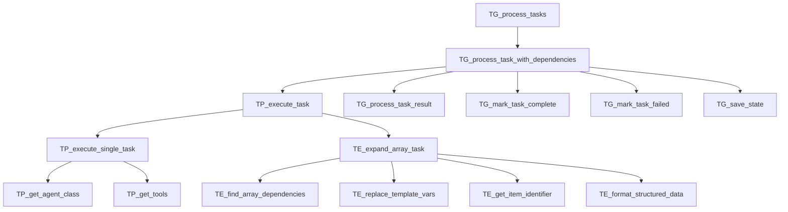
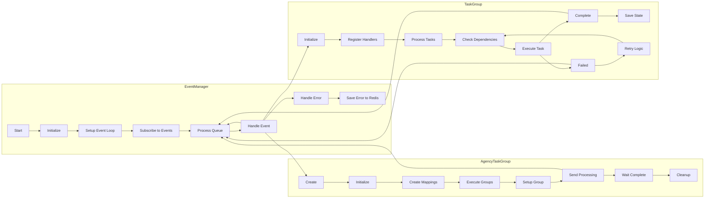

# Task Processing Flow Diagram

This diagram illustrates the task processing workflow for handling task groups, task execution, and task expansion in a top-to-bottom flow. The diagram shows the key processing stages and dependencies between components.

## Components

### Task Group Processing (TG)
- TG_process_tasks: Main entry point for processing task groups
- TG_process_task_with_dependencies: Handles dependency resolution and execution
- TG_process_task_result: Processes results after task completion
- TG_mark_task_complete/failed: Task state management
- TG_save_state: Persistence of task state

### Task Processing (TP)
- TP_execute_task: Core task execution logic
- TP_execute_single_task: Individual task processing
- TP_get_agent_class: Agent resolution for task execution
- TP_get_tools: Tool management for task execution

### Task Expansion (TE)
- TE_expand_array_task: Handles array-based task processing
- TE_find_array_dependencies: Resolves dependencies for array tasks
- TE_replace_template_vars: Template variable substitution
- TE_format_structured_data: Data formatting for array tasks

# Task Processing Flow Diagram

This diagram illustrates the task processing workflow and dependencies between different components of the system. It shows how tasks are processed, executed, and managed through various stages.

## Components

### Task Group Processing
- Task group processing and dependency management
- Task execution and state management 
- Result handling and completion tracking

### Task Expansion
- Array task expansion and processing
- Dependency resolution
- Template variable replacement
- Structured data formatting

### Core Operations  
- Agent class resolution
- Tool management and execution
- State persistence

